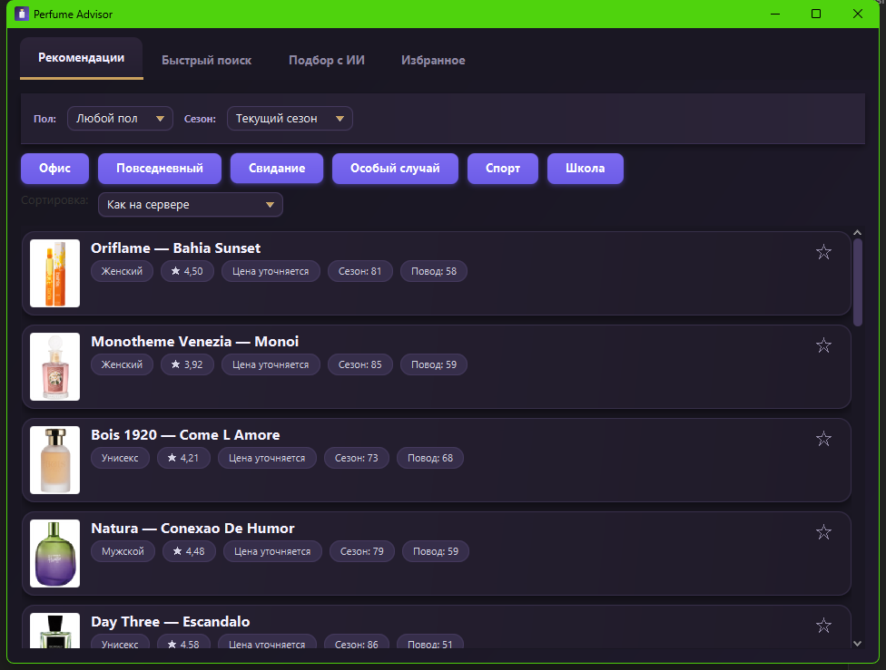
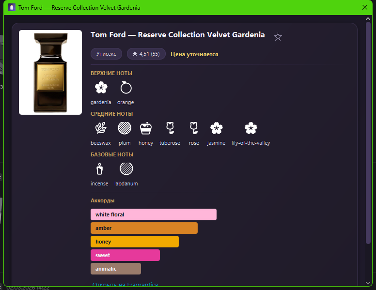

# Perfume Advisor

A desktop app for finding the right perfume: a catalog of ~24k fragrances, recommendations by occasion and season, full-text search, AI-assisted matching via a local LLM (Ollama), and favorites. Spring Boot backend, JavaFX client.

<p align="center">
  
  
</p>

## Features

- **Recommendations** — top fragrances by occasion (office, everyday, date night, special event, sport, school) and the current season, with a gender filter and sorting.
- **Quick search** — full-text search across the catalog (brand/name), including common brand abbreviations (JPG, YSL, D&G, CK, TF...) and transliteration tolerance.
- **AI search** — a free-form description ("a warm bittersweet winter scent for her") is turned into a deterministic catalog search; a local LLM (Ollama) only explains the picks.
- **Favorites** — a star on any card adds a fragrance to its own tab; stored locally at `~/.perfume-advisor/favorites.json`, no backend involved.
- **Fragrance card** — photo, note pyramid (top/middle/base) with icons, accords as proportional bars, price (where available), and a link to Fragrantica.

## Architecture

A multi-module Maven project on Java 21:

| Module | Purpose |
|---|---|
| `perfume-common` | Shared DTOs and enums used by both backend and client |
| `perfume-backend` | Spring Boot REST API: catalog, recommendations, search, AI matching |
| `perfume-client` | JavaFX client — a thin UI on top of the REST API |

**Stack:** Java 21, Spring Boot 3.3.5, PostgreSQL + Flyway, Redis, JavaFX 21, Ollama (local LLM), Maven.

## Getting started

### 1. Infrastructure

```bash
docker compose up -d
```

Starts Postgres (port `5433`) and Redis (port `6379`).

### 2. Ollama (for the AI search tab)

```bash
ollama pull qwen2.5:3b
ollama serve
```

Without Ollama, the rest of the app (recommendations, search, favorites) works fine — only the AI search tab breaks.

### 3. Catalog data

The source dataset (Fragrantica, ~24k fragrances) isn't included in the repo due to size — drop the CSV at `perfume-backend/data/fragrantica_dataset.csv` and run the backend with import and scoring enabled:

```bash
mvn -pl perfume-backend spring-boot:run -Dspring-boot.run.arguments="--perfume.import.enabled=true --perfume.scoring.enabled=true"
```

This is a one-off operation: the importer populates the database, and scoring computes how well each fragrance fits each season/occasion. Regular runs afterward don't need these flags.

Optionally, prices can be pulled from a CSV of marketplace listings (e.g. an eBay dataset) in a separate run:

```bash
mvn -pl perfume-backend spring-boot:run -Dspring-boot.run.arguments="--perfume.price-import.enabled=true --perfume.price-import.paths=/path/to/prices.csv"
```

Multiple files can be passed comma-separated. A price is only set where the matcher found both a brand match and a distinguishing name match — it won't cover the whole catalog.

### 4. Running the backend normally

```bash
mvn -pl perfume-backend spring-boot:run
```

The backend comes up on `http://localhost:8080`. Swagger UI is at `/swagger-ui.html`.

### 5. Client

```bash
mvn -pl perfume-client javafx:run
```

The client talks to `http://localhost:8080` by default; override with `-Dbackend.url=http://host:8080`.

## Standalone executable (Windows)

The client can be packaged into a self-contained `.exe` with an embedded Java runtime — no JDK needed on the target machine:

```bash
mvn -pl perfume-client -am package
jpackage --type app-image --input perfume-client/target --main-jar perfume-client-<version>-shaded.jar \
  --main-class com.perfumeadvisor.client.Launcher --name "Perfume Advisor" --icon perfume-client/src/main/resources/icon.ico
```

Note: this only packages the client. It still talks to the backend over the network (`localhost:8080` by default), so running it on another machine requires the backend to be reachable — either deployed alongside it, or the client launched with `-Dbackend.url=http://<backend-address>:8080`.

## REST API

| Method | Path | Description |
|---|---|---|
| `GET` | `/api/recommendations` | Recommendations by `occasion` (required), `gender`, `season`, `limit`, `sort` |
| `GET` | `/api/recommendations/search` | Full-text search by `query`, `limit` |
| `POST` | `/api/ai-recommendations` | Matching from a free-form description via Ollama |

## Tests

```bash
mvn test
```

Covers: transliteration and preference extraction from text for AI search, recommendation ranking, repositories (Testcontainers), and client-side utilities (accord colors, note icons, sorting).

## Known limitations

- Prices aren't available for every fragrance — the data source (eBay listings) covers only part of the catalog, and only men's fragrances.
- AI search requires a local Ollama instance; no external LLM provider keys are used.
- Favorites are stored locally in a file on disk — not synced across devices.
